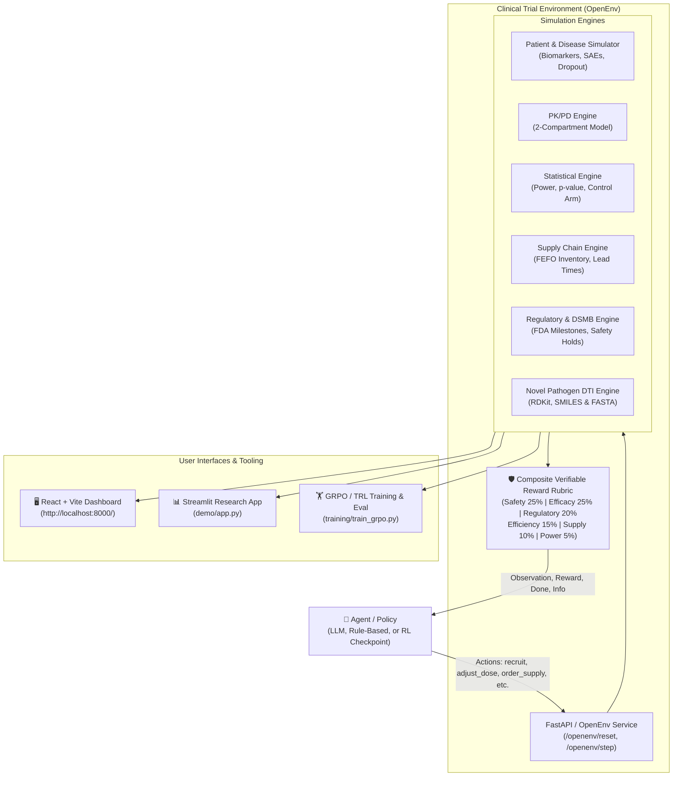

# 🔬 Clinical Trial Simulator

<div align="center">

[](https://opensource.org/licenses/MIT)
[](https://www.python.org/)
[](https://fastapi.tiangolo.com/)
[](https://reactjs.org/)
[](openenv.yaml)
[](https://pytorch.org/)
[](Dockerfile)

**An open, research-only environment for training, evaluating, and aligning decision-making agents in simulated clinical trials.**

[Features](#-key-features) • [Architecture](#-system-architecture) • [Quick Start](#-quick-start) • [Actions](#-action-space-reference) • [API Directory](#-api-endpoint-reference) • [DTI Engine](#-novel-pathogen-dti-predictor) • [Training](#-training--evaluation)

</div>

---

> [!IMPORTANT]
> **Disclaimer:** This project uses synthetic data and mathematical simulation models. It is built strictly for scientific research into sequential decision-making and reinforcement learning. It is **not** medical advice, clinical decision support, or a substitute for professional clinical judgement.

---

## 🎯 Motivation

Managing a clinical trial requires navigating complex, multi-year trade-offs across competing domain axes:

- **Efficacy vs. Safety:** Increasing dosage may accelerate therapeutic response but elevates the risk of severe toxicity and Adverse Events (SAEs).
- **Recruitment vs. Operations:** Accelerating patient enrollment increases statistical power but risks supply chain stockouts, site overburdening, and budget exhaustion.
- **Speed vs. Regulatory Compliance:** Omitting interim monitoring or rushing protocol updates can cause regulatory holds from the FDA or DSMB interventions.

The **Clinical Trial Simulator** provides a standardized, gym-like **OpenEnv** reinforcement learning environment where LLM agents and RL policies solve these multi-faceted decision problems across 52-week clinical trial horizons.

---

## ✨ Key Features

- **🏥 Patient & Disease Trajectory Dynamics:** Simulates enrollment, retention/dropout, biomarker progression, and adverse events across therapeutic areas (*Type 2 Diabetes*, *Hypertension*, *Non-Small Cell Lung Cancer (NSCLC)*).
- **💊 PK/PD & Drug Formulation Control:** 2-compartment pharmacokinetics/pharmacodynamic modeling, dynamic dose titration, target therapeutic range monitoring, and drug component ratio adjustments.
- **📦 Supply Chain Logistics:** Multi-site trial site management, FEFO (First-Expired, First-Out) inventory dispatch, expiry tracking, stockout penalties, and reorder lead times.
- **📊 Statistical Power & Regulatory Safety:** Real-time control arm comparison, survival analysis, p-value calculations, Data and Safety Monitoring Board (DSMB) reviews, and FDA meeting milestones through NDA filing.
- **🧬 Novel Pathogen DTI Predictor:** AI-powered Drug-Target Interaction (DTI) pipeline evaluating SMILES drug structures against FASTA target sequences using RDKit & molecular descriptors.
- **🤝 Specialist Advisory Agents:** Built-in multi-agent advisors (CMO, Biostatistician, PK Lead, Patient Advocate, Regulatory Lead, Safety Lead, Pharmacoeconomist).
- **🛡️ Verifiable Anti-Cheat Reward Rubric:** Multidimensional reward structure evaluating safety, efficacy, regulatory progress, budget efficiency, supply adequacy, and statistical power.
- **🖥️ Dual Interactive User Interfaces:** Production React + Vite + Tailwind dashboard served directly alongside a Streamlit scientific analysis explorer.

---

## 📐 System Architecture



---

## ⚡ Quick Start

### 1. Prerequisites

- **Python:** `3.11` or `3.12`
- **Node.js:** `20+` (required only for compiling/building the React frontend)
- **Git**

### 2. Installation

Clone the repository and install the project in editable mode:

```bash
# Clone repository
git clone https://github.com/Vishal-2203/clinical-trial-simulator1.git
cd clinical-trial-simulator1

# Create and activate virtual environment
python -m venv .venv
source .venv/bin/activate        # On Windows: .venv\Scripts\Activate.ps1

# Upgrade pip and install core dependencies with test runner
pip install --upgrade pip
pip install -e '.[test]'
```

> [!TIP]
> If you plan to train RL/LLM policies locally using GRPO and PyTorch, install the training extra: `pip install -e '.[train]'`.

---

### 3. Launching the Services

#### Option A: FastAPI Server & Built-in React Dashboard

Start the backend API server. If the React frontend has been built, the API automatically serves the React UI at the root URL:

```bash
uvicorn server.openenv_api:app --reload --port 8000
```

- **Interactive API Docs (Swagger UI):** [`http://localhost:8000/docs`](http://localhost:8000/docs)
- **OpenEnv Metadata Endpoint:** [`http://localhost:8000/openenv/metadata`](http://localhost:8000/openenv/metadata)
- **Web Dashboard:** [`http://localhost:8000/`](http://localhost:8000/)

#### Option B: React Frontend Development Server

To run the React application with hot-reloading:

```bash
cd frontend
npm install
npm run dev
```

Vite will serve the frontend (typically at `http://localhost:5173`) connected to the API at `http://localhost:8000`.

#### Option C: Streamlit Scientific Explorer

Launch the standalone Streamlit dashboard for interactive state exploration and PK/PD visualization:

```bash
streamlit run demo/app.py
```

---

## 🕹️ Action Space Reference

Agents interact with the environment by sending actions via `POST /openenv/step`. Supported action types:

| Action Name | Parameter | Description |
| :--- | :--- | :--- |
| `recruit` | `magnitude` (int: 1–50) | Enrolls new synthetic patients across active clinical trial sites. |
| `adjust_dose` | `magnitude` (float: -0.5 to +0.5) | Titrates therapeutic dosage level relative to nominal baseline. |
| `update_composition` | `composition` (`{a, b, c}`) | Modifies drug compound component ratios (must sum to 1.0). |
| `hold_enrollment` | N/A (`magnitude: 0`) | Temporarily freezes patient recruitment for safety evaluation. |
| `file_interim_report` | N/A (`magnitude: 0`) | Submits trial data to biostatistics for formal interim analysis. |
| `implement_amendment` | N/A (`magnitude: 0`) | Applies protocol modifications to address safety or power concerns. |
| `request_dsmb_review` | N/A (`magnitude: 0`) | Triggers emergency Data and Safety Monitoring Board review. |
| `order_drug_supply` | `magnitude` (int units) | Issues an order to restock investigational drug supply at trial sites. |
| `request_fda_meeting` | N/A (`magnitude: 0`) | Requests a formal Type B/C meeting with FDA regulatory reviewers. |
| `implement_adaptive_randomization` | N/A (`magnitude: 0`) | Rebalances patient allocation based on interim efficacy signals. |
| `noop` | N/A (`magnitude: 0`) | Advances simulation clock by 1 week without changing trial parameters. |

---

## ⚖️ Verifiable Composite Reward Structure

To prevent gaming and ensure safety compliance, the reward function is calculated as a composite rubric across 6 verifiable dimensions:

$$\text{Reward} = 0.25 R_{\text{safety}} + 0.25 R_{\text{efficacy}} + 0.20 R_{\text{regulatory}} + 0.15 R_{\text{efficiency}} + 0.10 R_{\text{supply}} + 0.05 R_{\text{power}}$$

- **Safety (25%):** Penalizes serious adverse events (SAEs), unmonitored toxicity, and delayed safety holds.
- **Efficacy (25%):** Rewards sustained biomarker reduction relative to control arm baseline.
- **Regulatory Compliance (20%):** Rewards FDA milestone completion; heavily penalizes overdue SAE reporting.
- **Financial Efficiency (15%):** Penalizes budget overruns and inefficient resource allocation.
- **Supply Chain (10%):** Penalizes patient stockouts and expired drug supply waste.
- **Statistical Power (5%):** Rewards maintaining estimated trial power $\ge 80\%$.

---

## 📡 API Endpoint Reference

| Endpoint Path | Method | Description |
| :--- | :---: | :--- |
| `/health` | `GET` | Service health status check |
| `/openenv/metadata` | `GET` | Environment action/observation space schema |
| `/openenv/reset` | `POST` | Initialize a new seeded clinical trial session |
| `/openenv/step` | `POST` | Step trial session forward with an action |
| `/simulation/state/{session_id}` | `GET` | Full unmasked simulation state dump |
| `/simulation/pkpd/{session_id}` | `GET` | 2-compartment PK/PD concentration time series |
| `/simulation/statistics/{session_id}` | `GET` | Power analysis, p-value, and hazard ratios |
| `/simulation/dsmb/{session_id}` | `GET` | DSMB review history and safety flags |
| `/simulation/supply/{session_id}` | `GET` | Site inventory, stockouts, and expiry status |
| `/simulation/agents/{session_id}` | `GET` | Multi-agent specialist advice (CMO, Biostat, Safety, etc.) |
| `/simulation/economics/{session_id}` | `GET` | Budget usage, ICER, and NDA filing signals |
| `/dti/analyze` | `POST` | Predict drug-target efficacy & toxicity for custom SMILES/FASTA |
| `/dti/model-status` | `GET` | Status check of trained DTI checkpoint (`dti_model.pt`) |
| `/dti/drug-lookup` | `GET` | Look up SMILES and target family by drug name |

---

## 🧪 Novel Pathogen DTI Predictor

The environment incorporates an inferential **Drug-Target Interaction (DTI)** machine learning model located in `src/cts/dti/`. It enables researchers to evaluate novel drug candidates against emergent pathogen targets.

```python
import requests

response = requests.post(
    "http://localhost:8000/dti/analyze",
    json={
        "smiles": "CC(=O)OC1=CC=CC=C1C(=O)O",  # Aspirin SMILES
        "target_fasta": "MDSKGSSQKGSRLLLLLVVSNLLLCQGVVS...",  # Pathogen protein sequence
        "disease_context": "nsclc"
    }
).json()

print("Efficacy Score:", response["efficacy_score"])
print("Toxicity Class:", response["toxicity_class"])
```

- **Drug Encoder:** RDKit chemical fingerprints + structural descriptors derived from SMILES input.
- **Target Encoder:** Protein sequence k-mer embeddings & ChEMBL family resolution.
- **Checkpoint Location:** `artifacts/dti/dti_model.pt`

---

## 🐍 Python Client Usage Example

```python
import requests

BASE_URL = "http://localhost:8000"

# 1. Reset environment with a random seed
session = requests.post(f"{BASE_URL}/openenv/reset", json={"seed": 42}).json()
session_id = session["session_id"]
print(f"Session Started: {session_id}")

# 2. Step 1: Recruit 10 patients
step1 = requests.post(
    f"{BASE_URL}/openenv/step",
    json={
        "session_id": session_id,
        "action_type": "recruit",
        "magnitude": 10
    }
).json()

print(f"Week {step1['state']['current_week']} | Reward: {step1['reward']:.4f}")

# 3. Step 2: Adjust dose slightly upward
step2 = requests.post(
    f"{BASE_URL}/openenv/step",
    json={
        "session_id": session_id,
        "action_type": "adjust_dose",
        "magnitude": 0.1
    }
).json()

# 4. Fetch specialist advisor recommendations
advisors = requests.get(f"{BASE_URL}/simulation/agents/{session_id}").json()
print("CMO Recommendation:", advisors["cmo_perspective"])
```

---

## 🏋️ Training & Evaluation

### Training Policies with GRPO (Group Relative Policy Optimization)

The project includes training pipelines built on `TRL`, `Unsloth`, and `Accelerate`:

```bash
# Run GRPO training using 8GB GPU config
python training/train_grpo.py \
  --backend trl \
  --config training/configs/grpo_gpu_8gb.yaml \
  --output artifacts/policy/latest_llm.json
```

### Benchmarking Checkpoints

Evaluate trained policy checkpoints against rule-based and baseline agents across 12 test episodes:

```bash
python -m eval.run_benchmark \
  --episodes 12 \
  --trained-checkpoint artifacts/policy/latest_llm.json \
  --output-dir artifacts/benchmark
```

Benchmark outputs, comparison charts, and evaluation logs are saved into `artifacts/benchmark/`.

---

## 🧪 Testing & Verification

Run the automated test suite with `pytest`:

```bash
# Run full unit and integration test suite
pytest

# Run lightweight end-to-end smoke test
python smoke_test.py
```

---

## 🐳 Docker Setup

Build and execute the complete environment (API + Frontend) inside a container:

```bash
# Build Docker image
docker build -t clinical-trial-simulator .

# Run container on port 8000
docker run --rm -p 8000:8000 clinical-trial-simulator
```

---

## 📁 Repository Structure

```text
clinical-trial-simulator1/
├── src/cts/                      # Core Clinical Trial Simulator Python package
│   ├── environment/              # Trial state machine, step logic, event queue
│   ├── patient/                  # Synthetic patient generators & disease models
│   ├── policy/                   # Efficacy/toxicity heads & reference policies
│   ├── rewards/                  # Verifiable composite reward functions
│   ├── site/                     # Site recruitment & trial site operations
│   ├── supply/                   # Drug inventory & FEFO supply chain simulation
│   ├── statistics/               # Power analysis, p-values, control arm stats
│   ├── agents/                   # Specialist advisory agents (CMO, Biostat, Safety)
│   └── dti/                      # Novel Pathogen DTI inference & training pipeline
├── server/                       # FastAPI / OpenEnv REST API service layer
├── frontend/                     # Modern React + Vite + Tailwind web dashboard
├── demo/                         # Interactive Streamlit research dashboard
├── training/                     # GRPO training scripts and configuration files
├── eval/                         # Benchmarking & policy evaluation framework
├── tests/                        # Automated unit & integration test suite
├── artifacts/                    # Trained model checkpoints, plots, and benchmark results
├── Dockerfile                    # Containerization specification
├── openenv.yaml                  # OpenEnv environment metadata specification
└── pyproject.toml                # Project packaging & dependencies
```

---

## 🤝 Contributing

Contributions are welcome! Please adhere to these guidelines:
1. Ensure all changes are covered by unit tests in `tests/`.
2. Maintain zero regression on safety and reward verification checks.
3. Keep real patient data strictly out of the repository (all data must remain synthetic).

---

## 📄 License

This repository is licensed under the [MIT License](LICENSE).
